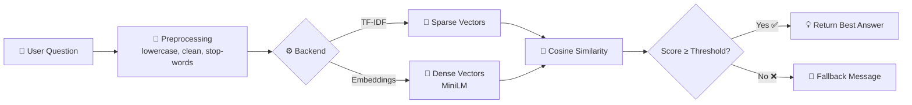

<div align="center">

# 🤖📊 Data Science Chatbot

### An end-to-end NLP project that answers Data Science & Machine Learning questions


*Ask about overfitting, PCA, cross-validation, TF-IDF, random forests, A/B testing and more.*

</div>

---

## 📑 Table of Contents
- [✨ Features](#-features)
- [🧠 How It Works](#-how-it-works)
- [🗂️ Project Structure](#️-project-structure)
- [🚀 Quick Start](#-quick-start)
- [💬 Example Conversation](#-example-conversation)
- [📈 Evaluation](#-evaluation)
- [🛠️ Tech Stack](#️-tech-stack)
- [🔮 Future Improvements](#-future-improvements)

---

## ✨ Features

| | Feature | Description |
|---|---|---|
| 🔍 | **Retrieval-based answers** | Finds the most relevant answer from a curated Data Science knowledge base |
| ⚡ | **Two backends** | Lightweight **TF-IDF** (CPU, instant) or smarter **Sentence Embeddings** |
| 🚫 | **Out-of-scope detection** | Politely says "I don't know" when a question is off-topic |
| 👋 | **Small talk** | Handles greetings and thank-yous |
| 🌐 | **Web interface** | Clean Streamlit chat UI with a debug panel showing match scores |
| 🧪 | **Built-in evaluation** | Measures top-1 / top-3 accuracy on paraphrased questions |

---

## 🧠 How It Works



### 🔄 End-to-End Pipeline

| Step | Phase | What happens |
|:---:|---|---|
| 1️⃣ | **Problem Definition** | Answer DS questions; reject anything out of scope |
| 2️⃣ | **Data Collection** | `kb.json` with 28 Q&A entries (id, question, answer, tags) |
| 3️⃣ | **Preprocessing** | Lowercasing, punctuation removal, stop-words, uni + bigrams |
| 4️⃣ | **Representation** | TF-IDF or `all-MiniLM-L6-v2` sentence embeddings |
| 5️⃣ | **Retrieval** | Cosine similarity → top-k matches → threshold check |
| 6️⃣ | **Evaluation** | Top-1 / top-3 accuracy + out-of-scope rejection |
| 7️⃣ | **Deployment** | Streamlit app (deployable to Streamlit Cloud / HF Spaces) |
| 8️⃣ | **Monitoring** | Log unanswered queries and grow the knowledge base |

---

## 🗂️ Project Structure

```
ds_chatbot/
├── 📄 chatbot.py        # Core chatbot class (retrieval logic)
├── 🌐 app.py            # Streamlit web interface
├── 🧪 evaluate.py       # Accuracy evaluation script
├── 📦 requirements.txt  # Dependencies
├── 📘 README.md         # You are here
└── 📁 data/
    └── 🗃️ kb.json       # Knowledge base (28 Data Science Q&As)
```

---

## 🚀 Quick Start

### 1️⃣ Create a virtual environment
```bash
python -m venv venv

# Windows (PowerShell)
venv\Scripts\activate

# Mac / Linux
source venv/bin/activate
```

### 2️⃣ Install dependencies
```bash
pip install -r requirements.txt
```
> 💡 **Tip:** `sentence-transformers` is a large download (1–2 GB). For a lightweight setup run:
> `pip install scikit-learn streamlit`

### 3️⃣ Run the project

| 🎯 What | ⌨️ Command |
|---|---|
| 💻 Terminal chatbot | `python chatbot.py` |
| 🌐 Web app | `streamlit run app.py` |
| 🧪 Evaluate (TF-IDF) | `python evaluate.py tfidf` |
| 🧪 Evaluate (Embeddings) | `python evaluate.py embeddings` |

The web app opens at **http://localhost:8501** 🎉

---

## 💬 Example Conversation

```text
You: hello
Bot: Hi! Ask me anything about data science and machine learning.

You: what is overfitting?
Bot: Overfitting is when a model learns noise in the training data and performs
     poorly on new data. Fix it with more data, regularization, simpler models,
     dropout, early stopping or cross-validation.

You: difference between precision and recall
Bot: Precision = TP/(TP+FP), how many predicted positives are correct.
     Recall = TP/(TP+FN), how many actual positives were found. ...

You: what's the weather today?
Bot: I'm not sure about that one. Try asking about topics like overfitting,
     cross-validation, PCA, TF-IDF, random forests or A/B testing.
```

---

## 📈 Evaluation

Baseline results using **TF-IDF** on 15 paraphrased questions plus 3 off-topic ones:

| 📊 Metric | 🎯 Score |
|---|:---:|
| Top-1 accuracy | **80%** |
| Top-3 accuracy | **87%** |
| Out-of-scope rejection | **3 / 3** |

> 🔎 **Insight:** Most misses are paraphrases with no shared keywords (e.g. *"model does great on train but badly on test"* → overfitting). Sentence embeddings are designed to fix exactly this, so compare with `python evaluate.py embeddings`.

---

## 🛠️ Tech Stack

| Layer | Tools |
|---|---|
| 🐍 Language | Python |
| 🧮 NLP / ML | scikit-learn (TF-IDF, cosine similarity) |
| 🧬 Embeddings | sentence-transformers (`all-MiniLM-L6-v2`) |
| 🌐 Frontend | Streamlit |
| 🗃️ Data | JSON knowledge base |

---

## 🔮 Future Improvements

- [ ] 🧵 Conversation memory for follow-up questions ("what about L1?")
- [ ] 🎯 Intent classifier (Logistic Regression / DistilBERT) before retrieval
- [ ] 🧠 RAG: send top matches to an LLM to generate grounded answers
- [ ] ⚡ FAISS vector search for 500+ entries
- [ ] ✍️ Spell correction with `rapidfuzz`
- [ ] 🐳 Docker image and cloud deployment
- [ ] 📝 Logging of unanswered questions for knowledge base growth

---

<div align="center">

## 👩‍💻 Author

### Ch. Swetharani
**Data Scientist** · Designed and implemented this project

</div>
